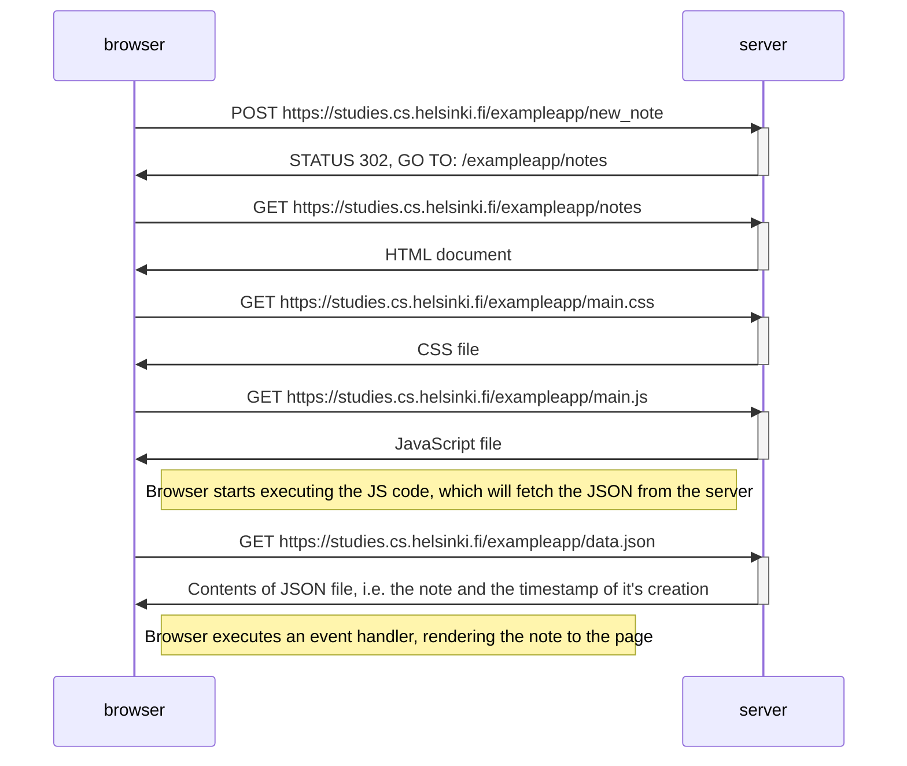

# EXERCISE 0.4: NEW NOTE DIAGRAM

```mermaid
sequenceDiagram
  participant browser
  participant server

  browser->>server: POST https://studies.cs.helsinki.fi/exampleapp/new_note
  activate server
  server->>browser: STATUS 302, GO TO: /exampleapp/notes
  deactivate server

  browser->>server: GET https://studies.cs.helsinki.fi/exampleapp/notes
  activate server 
  server->>browser: HTML document
  deactivate server

  browser->>server: GET https://studies.cs.helsinki.fi/exampleapp/main.css
  activate server
  server->>browser: CSS file
  deactivate server

  browser->>server: GET https://studies.cs.helsinki.fi/exampleapp/main.js
  activate server
  server->>browser: JavaScript file
  deactivate server

  Note right of browser: Browser starts executing the JS code, which will fetch the JSON from the server

  browser->>server: GET https://studies.cs.helsinki.fi/exampleapp/data.json
  activate server
  server->>browser: Contents of JSON file, i.e. the note and the timestamp of it's creation
  deactivate server

  Note right of browser: Browser executes an event handler, rendering the note to the page
```
